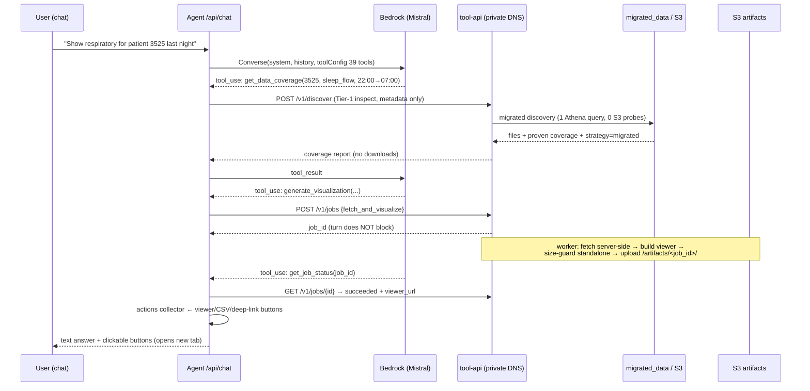
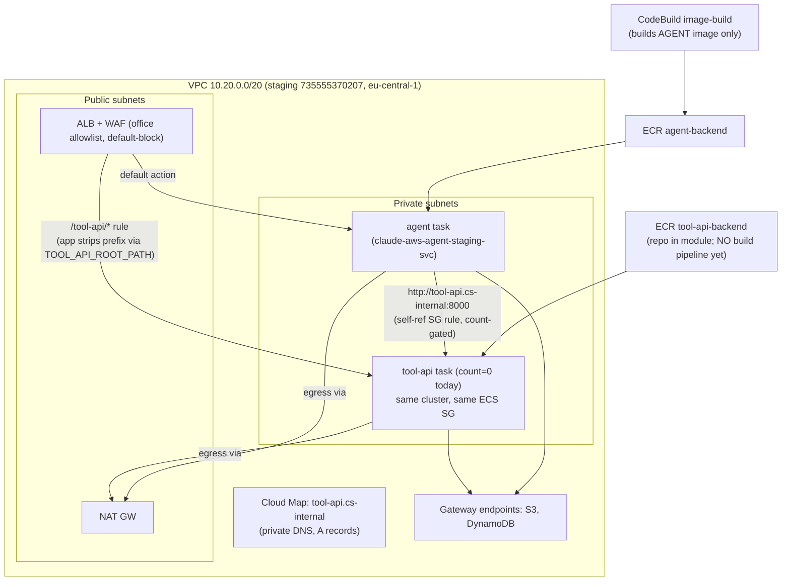
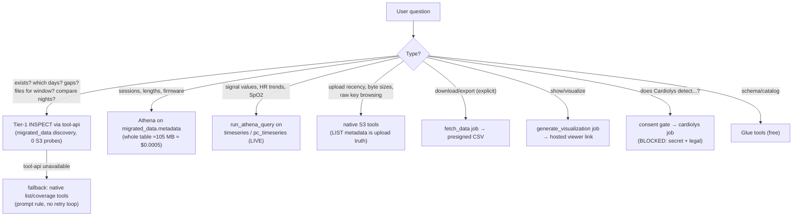

# System Architecture — CardiacSense Data Agent + Deterministic Tool

> Status snapshot: 2026-06-10. Agent is **deployed** on staging; the tool-api is
> **code-complete + live-validated but not yet deployed** (Terraform wired,
> `enable_tool_api=false`). Sources of truth: this repo (agent, infra, prompts)
> and `CardiacSense-s3-downloader-tool` (deterministic engine + tool-api).
> Companion docs: [CAPABILITY_MATRIX.md](CAPABILITY_MATRIX.md),
> `CardiacSense-s3-downloader-tool/docs/E2E_VALIDATION_AND_INTELLIGENCE.md`,
> `CardiacSense-s3-downloader-tool/docs/TOOL_API_REFERENCE.md`.

## 1. High-level architecture

```mermaid
flowchart LR
    subgraph Client["Browser (office CIDRs only)"]
        UI["Chat SPA (React/Vite)\nrenders text + tool_trace + actions buttons"]
        TUI["tool-ui (FUTURE)\nmanual deterministic GUI"]
    end

    subgraph Edge["Shared edge"]
        WAF["WAF\ndefault-BLOCK + office allowlist + rate limit"]
        ALB["ALB\n'/' + /api/* -> agent\n/tool-api/* -> tool-api"]
    end

    subgraph AgentSvc["Agent service (ECS Fargate, deployed)"]
        API["FastAPI /api/chat"]
        LOOP["Converse loop (hand-rolled)\nBedrock mistral.devstral-2-123b\n(Claude blocked by org SCP)"]
        REG["Tool REGISTRY (39 tools)\n28 native boto3 + 11 data-tool wrappers"]
        ACT["actions collector\n(deterministic buttons, LLM never writes URLs)"]
    end

    subgraph ToolSvc["tool-api service (ECS Fargate, NOT YET DEPLOYED)"]
        TAPI["FastAPI tool_api\ninspect (sync) + jobs (async) + Cardiolys"]
        CORE["core.service (deterministic engine)\ndiscovery, fetch, coverage, visualize"]
        JOBS["JobManager (in-process v1)\nfetch / visualize / cardiolys_analyze"]
    end

    subgraph Data["Data sources (staging 735555370207)"]
        BR["Bedrock Converse"]
        ATH["Athena: migrated_data\n(timeseries, pc_timeseries, metadata...)"]
        S3D["S3 data buckets\napp-events, migrated--data"]
        DDB["DynamoDB\nsessions, cost, patient-id-map, (jobs)"]
        PAPI["Patients API (internal HTTP)\npatient_id -> UUID"]
        SM["Secrets Manager\nINTERNAL_TOKEN, (cardiolyse: MISSING)"]
        CARD["Cardiolys vendor API (EXTERNAL)\nconsent-gated, not enabled"]
        ART["S3 artifacts\noutput bucket /artifacts/<job_id>/"]
    end

    UI --> WAF --> ALB
    TUI -.-> WAF
    ALB --> API --> LOOP --> REG
    LOOP --> BR
    REG -->|native boto3| ATH & S3D & DDB & PAPI & SM
    REG -->|httpx via Cloud Map DNS\n(private, no WAF)| TAPI
    REG --> ACT --> API
    ALB -.->|/tool-api/* (browser only)| TAPI
    TAPI --> CORE --> ATH & S3D & PAPI & SM
    TAPI --> JOBS --> ART
    JOBS -.->|gated: consent + secret + legal| CARD
```

## 2. Request flow — chat → answer (+ artifacts)



Key invariants:
- **Tier 1 inspect never downloads** (Athena + S3 metadata/KB-probes only).
- **Tier 2 fetch runs only on explicit user request**; output = presigned link.
- **Tier 3 visualize** = cloud artifact + hosted viewer link; standalone capped at
  `TOOL_API_STANDALONE_MAX_MB` (default 200 — live validation produced an 818 MB
  standalone for one full-day recording, which must never be presigned).
- **The LLM never fabricates URLs/UUIDs/S3 keys** — buttons come from the
  server-side actions collector; identity comes from the deterministic resolver.

## 3. Deployment / infra



Why private DNS for agent→tool-api: the WAF **default-blocks** anything not in
`office_cidrs`; the agent's NAT egress IP is not an office CIDR, so the public
ALB path is unusable for service-to-service calls (verified in module review).
The Cloud Map namespace, the self-referencing SG ingress rule, and the
`TOOL_API_BASE_URL` env are all **count-gated** with `enable_tool_api` — the live
`terraform plan` is unchanged until deployment is approved.

## 4. Capability routing (which path answers what)



## 5. Security & auth boundaries

| Boundary | Mechanism |
|---|---|
| Internet → ALB | WAF: default-**block**, office-CIDR allowlist, 1000 req/5min rate limit; HTTP today (ACM cert = phase 9) |
| Browser → tool-api | ALB `/tool-api/*` + bearer (`TOOL_API_TOKEN`, Secrets Manager) |
| Agent → tool-api | private Cloud Map DNS (no WAF in path) + same bearer |
| Agent task role | Bedrock invoke, Athena/Glue read, S3 data **read-only**, write only to own output/results buckets + DynamoDB own tables, `GetSecretValue` INTERNAL_TOKEN |
| tool-api task role | least-privilege mirror: S3 data read-only, write **only** `output/artifacts/*`, Athena/Glue read, patient-id-map RW, INTERNAL_TOKEN |
| External send (Cardiolys) | server-enforced consent (`confirm_external` or HTTP 412) + per-request user confirmation in prompt + audit log; **disabled** until secret + legal |
| Identity | patient_id↔UUID only via deterministic resolver (Patients API + DynamoDB cache + migrated epoch-linkage); LLM forbidden from deriving |
| Artifacts | private S3, presigned URLs (1 h TTL), standalone size-capped |

## 6. Data & artifact flow (tiers)

| Tier | Reads | Writes | User receives | Local download? |
|---|---|---|---|---|
| 1 Inspect | Athena `migrated_data` + S3 metadata/KB-probes | nothing | answer + buttons | no |
| 2 Fetch (explicit) | S3 objects (server-side, ephemeral tmp) | `s3://…output/artifacts/<job_id>/` | presigned CSV link | only if clicked |
| 3 Visualize | S3 objects (server-side, ephemeral tmp) | artifacts folder (viewer + capped standalone) | hosted viewer link (new tab) | only if clicked |

## 7. Known blockers & external dependencies

| Item | Status | Owner/action |
|---|---|---|
| `terraform apply` (tool-api enablement) | gated | user approval + §16 decisions (`/tool-ui` & `/artifacts` hosting, auth, SQS) |
| tool-api **image build pipeline** | missing | CodeBuild builds agent only; `Dockerfile.api` exists in the tool repo — needs a CodeBuild project or manual build/push |
| `/artifacts` hosted Range serving | not built | needed for large viewers (data.bin streamed); CloudFront+S3 OAC recommended |
| `/tool-ui` web app | not built | the manual-GUI escape hatch (PySide6 cannot be served) |
| Cardiolys live | **hard-blocked** | secret `claude-aws-agent-staging-cardiolyse` absent + legal clearance for external ECG send |
| Claude on Bedrock | SCP-blocked | org SCP denies `anthropic.*`; Mistral devstral-2 validated for tool-use, but weaker multi-step orchestration |
| Postgres patients table from ECS | unreachable (bastion-only SG) | not required — HTTP resolver + migrated epoch-linkage cover identity |
| Jobs durability | in-process v1 (state lost on task restart) | acceptable staging; SQS+worker later |
